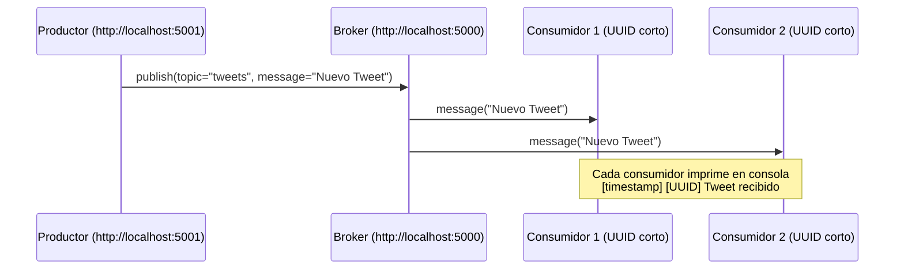

# 📘 Broker de Mensajes con Python + Flask + SocketIO
### Rene Plaz

## 🔧 Instalación de dependencias
Asegúrate de tener Python 3.10+ instalado. Luego, instala las librerías necesarias:
```bash
pip install flask flask-socketio python-socketio websocket-client
```

💡 Si trabajas en Windows, se recomienda usar un entorno virtual (venv) para aislar las dependencias.

## ▶️ Ejecución de las aplicaciones
1. Servidor Broker  
Inicia el broker en el puerto 5000:

```bash
python broker_server.py
``` 
Este proceso no se abre en navegador, solo en consola.

2. Productor Tweets  
Inicia el productor en el puerto 5001:

```bash
python producer.py
```

En caso requerir un nuevo productor

```bash
python producer.py 5002
```

Accede desde el navegador a:
👉 http://localhost:5001 (localhost in Bing)  
Allí podrás escribir un tweet y enviarla con el botón.

3. Consumidor Tweets  
Cada vez que ejecutes:

```bash
python consumer.py
```
Se abrirá un nuevo consumidor con un ID único (UUID corto).
Los mensajes se mostrarán en la consola con timestamp.

## 📊 Diagrama de Secuencia


## 📌 Flujo resumido
1. El Productor envía un Tweet al Broker.

2. El Broker recibe el mensaje y lo distribuye a todos los consumidores suscritos al tópico Tweets.

3. Cada Consumidor imprime en consola el mensaje recibido junto con su UUID corto y el timestamp.